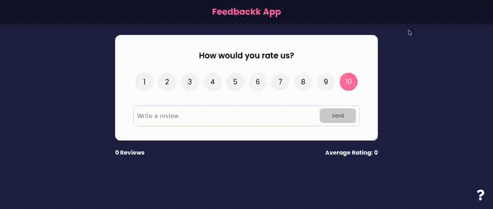

# Feedback app

### Overview

An application that simulates a feedback system.

### Demo

### Built with

- Reactjs
- Context API
- React Icons
- React Router DOM
- Mobile-first workflow

# Run the application

1. Clone the repository:
   `git clone https://github.com/lucasalustiano/feedback-app`

2. Enter the project directory:
   `cd feedback-app`

3. Install dependencies:
   `npm install`

4. Run the application:
   `npm start`

# Reach me

- Linkedin - [@lucasalustiano](https://www.linkedin.com/in/lucasalustiano/)
- Frontend Mentor - [@lucasalustiano](https://www.frontendmentor.io/profile/lucasalustiano)
